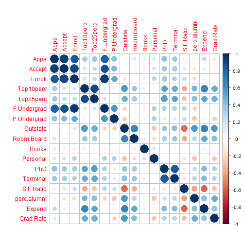

First lets turn off the unnecessary warnings, so as to make the work more appealing to the eyes.

```r
knitr::opts_chunk$set(warning = FALSE)
```

## **The Data**

First we load the data set and create a variable called USColleges that will store the entire Data Set.

```r
USColleges <- read.csv("College.csv")
```

Looking at the different components of the Dataset now.


```r
dim(USColleges)
```

```
## [1] 777  19
```

```r
str(USColleges)
```

```
## 'data.frame':	777 obs. of  19 variables:
##  $ X          : Factor w/ 777 levels "Abilene Christian University",..: 1 2 3 4 5 6 7 8 9 10 ...
##  $ Private    : Factor w/ 2 levels "No","Yes": 2 2 2 2 2 2 2 2 2 2 ...
##  $ Apps       : int  1660 2186 1428 417 193 587 353 1899 1038 582 ...
##  $ Accept     : int  1232 1924 1097 349 146 479 340 1720 839 498 ...
##  $ Enroll     : int  721 512 336 137 55 158 103 489 227 172 ...
##  $ Top10perc  : int  23 16 22 60 16 38 17 37 30 21 ...
##  $ Top25perc  : int  52 29 50 89 44 62 45 68 63 44 ...
##  $ F.Undergrad: int  2885 2683 1036 510 249 678 416 1594 973 799 ...
##  $ P.Undergrad: int  537 1227 99 63 869 41 230 32 306 78 ...
##  $ Outstate   : int  7440 12280 11250 12960 7560 13500 13290 13868 15595 10468 ...
##  $ Room.Board : int  3300 6450 3750 5450 4120 3335 5720 4826 4400 3380 ...
##  $ Books      : int  450 750 400 450 800 500 500 450 300 660 ...
##  $ Personal   : int  2200 1500 1165 875 1500 675 1500 850 500 1800 ...
##  $ PhD        : int  70 29 53 92 76 67 90 89 79 40 ...
##  $ Terminal   : int  78 30 66 97 72 73 93 100 84 41 ...
##  $ S.F.Ratio  : num  18.1 12.2 12.9 7.7 11.9 9.4 11.5 13.7 11.3 11.5 ...
##  $ perc.alumni: int  12 16 30 37 2 11 26 37 23 15 ...
##  $ Expend     : int  7041 10527 8735 19016 10922 9727 8861 11487 11644 8991 ...
##  $ Grad.Rate  : int  60 56 54 59 15 55 63 73 80 52 ...
```

## **Finiding Key Features**

Firstly, we know that the **College Name** will not contribute to the dataset in any possible way, so we create a new variable without the **College Name** or in this case, the variable **X**


```r
mydata <- USColleges[,2:19] # The First column is the college name. 
dim(mydata)
```

```
## [1] 777  18
```

Now we will run the **Principal ComponentAnalysis** and **Singular Vector Decomposition** in this new dataset, and try to find out the **relevant variables**.


```r
prcomp(mydata[,2:18])
```

```
## Standard deviations (1, .., p=17):
##  [1] 6560.330614 6148.628507 2498.985577 1708.369628 1200.894723  788.286575  610.361484  571.942158  198.195783
## [10]  159.112741   20.644711   14.476032   12.545558    8.994205    5.998576    5.194653    2.904872
## 
## Rotation (n x k) = (17 x 17):
##                       PC1           PC2           PC3           PC4           PC5           PC6           PC7
## Apps         5.570263e-01  0.0393606986  1.673533e-01 -6.642712e-01  1.646869e-01  5.805001e-02  0.1343426019
## Accept       3.477120e-01  0.0771620231  1.623635e-01 -2.329273e-01  5.805852e-03  6.028072e-02 -0.2399573361
## Enroll       1.298540e-01  0.0454128642  9.663434e-03  5.883235e-02 -6.407693e-02  2.130695e-02 -0.0408911751
## Top10perc    1.025389e-03 -0.0017055415  1.314474e-04 -1.225409e-04 -1.797369e-03  8.036970e-04  0.0018984182
## Top25perc    1.177421e-03 -0.0014970389  7.734472e-04  1.817197e-04 -1.909838e-03  5.523104e-04  0.0012509606
## F.Undergrad  6.706140e-01  0.2836718075 -2.467199e-02  5.849594e-01 -2.814371e-01 -8.531669e-02  0.0133217513
## P.Undergrad  1.111127e-01  0.0803795425 -6.614187e-02  3.028184e-01  9.235353e-01  1.461951e-01 -0.1026035541
## Outstate     5.484194e-02 -0.5693227860  7.586098e-01  2.539310e-01 -7.018530e-03  1.683414e-01  0.0502771148
## Room.Board   2.886552e-02 -0.1059911573  1.366009e-01 -1.045605e-02  1.781679e-01 -9.634095e-01  0.0647932773
## Books        3.734220e-03 -0.0014290636 -2.739530e-03  8.819261e-04  6.590733e-03 -2.124736e-02  0.0497284497
## Personal     2.313221e-02  0.0298378541 -6.030490e-02  4.973345e-02  6.630373e-02  8.308387e-02  0.9494853142
## PhD          1.138823e-03 -0.0008727170  6.278297e-04  1.064246e-03  2.147683e-04 -7.388842e-04 -0.0003391354
## Terminal     9.895713e-04 -0.0008337844  6.772324e-04  1.125964e-03  2.877545e-04 -1.473919e-03 -0.0004799486
## S.F.Ratio    2.859906e-05  0.0004275028  6.908259e-05 -2.505756e-05  1.112629e-05 -8.752959e-05 -0.0002483396
## perc.alumni -1.093329e-04 -0.0011075375  8.646199e-04  5.030482e-04 -1.273977e-03  1.536000e-03 -0.0014891545
## Expend       2.923904e-01 -0.7531527633 -5.854524e-01  9.095671e-03 -1.924232e-02  5.622383e-03 -0.0355651865
## Grad.Rate    3.203529e-04 -0.0013650208  2.150645e-03 -1.004804e-03 -1.696984e-03 -1.324539e-03 -0.0012577631
##                       PC8           PC9          PC10          PC11          PC12          PC13          PC14
## Apps        -0.4117935196  0.0274068846 -0.0037603414  0.0043885745 -0.0030218055  0.0005307394 -4.007964e-04
## Accept       0.8418069749 -0.1499897092  0.0058236220 -0.0082333714  0.0053672542 -0.0017596353 -1.075565e-03
## Enroll       0.1183684988  0.9783096229 -0.0077203036  0.0070856694 -0.0069258055 -0.0013171382  3.497235e-03
## Top10perc   -0.0074904898  0.0085115431  0.0042042949 -0.4368473612  0.2627325196 -0.2881680846  5.257687e-02
## Top25perc   -0.0064277218  0.0044807084  0.0056598115 -0.6220413584  0.3424975001 -0.3833091227  4.935310e-02
## F.Undergrad -0.1486037856 -0.1351603999 -0.0006118767  0.0019560795  0.0011169971  0.0007129263 -3.454547e-04
## P.Undergrad  0.0001828454  0.0170019941  0.0012309070 -0.0020522826  0.0024854847  0.0005722203  1.954095e-05
## Outstate    -0.0442263806 -0.0003089913  0.0023936845  0.0036681050 -0.0009818275 -0.0011142370  8.575232e-04
## Room.Board   0.0599821016  0.0282846916 -0.0256179003  0.0001263555  0.0015901407 -0.0018739877 -1.735666e-03
## Books        0.0098051429  0.0091782035  0.9983638165  0.0023867083 -0.0046189912  0.0063410759 -1.228008e-03
## Personal     0.2779069057  0.0013884373 -0.0489597665 -0.0021409962  0.0012458626  0.0019748045 -1.216373e-03
## PhD         -0.0006432685 -0.0002354317 -0.0060683267 -0.4502397729 -0.5712386308  0.1683169459  7.714274e-02
## Terminal    -0.0004205883 -0.0015687087  0.0014252510 -0.3689732067 -0.5323130216  0.1482511404 -3.408003e-02
## S.F.Ratio   -0.0002658706 -0.0003196800  0.0001251354 -0.0028812066 -0.0234890666  0.0053962473  2.921777e-02
## perc.alumni -0.0024433949  0.0058996308 -0.0017955078 -0.1477882762  0.1242005403  0.2009066258 -9.574093e-01
## Expend       0.0519314381 -0.0077922893 -0.0022115106  0.0012713591  0.0002307269  0.0005390100  1.774162e-04
## Grad.Rate   -0.0031226662  0.0052798234 -0.0020932194 -0.2476923793  0.4334732805  0.8241823726  2.649166e-01
##                      PC15          PC16          PC17
## Apps        -5.885535e-04 -1.127919e-03 -1.868469e-04
## Accept       1.250670e-03  2.473595e-03  2.325719e-04
## Enroll      -2.618667e-03 -3.102019e-03  6.243565e-05
## Top10perc    3.359247e-01  7.356159e-01  1.403704e-02
## Top25perc   -2.781733e-01 -5.185684e-01  1.256430e-03
## F.Undergrad  3.519353e-04  1.594045e-04 -1.731433e-04
## P.Undergrad  6.846898e-05  3.382395e-04  1.161583e-05
## Outstate    -3.931803e-05 -2.351418e-04  1.753847e-04
## Room.Board   6.495159e-04  3.738821e-05  7.988910e-05
## Books        4.780734e-03 -2.346881e-03 -3.483333e-04
## Personal    -3.688420e-04  7.592015e-05  3.717504e-04
## PhD          5.993922e-01 -2.759489e-01 -3.505036e-02
## Terminal    -6.667142e-01  3.358625e-01  6.301533e-03
## S.F.Ratio    1.892065e-02 -2.099494e-02  9.988783e-01
## perc.alumni  6.807484e-02 -1.669537e-02  2.777505e-02
## Expend      -2.031720e-04 -4.203305e-04  3.541588e-04
## Grad.Rate   -3.115651e-02  1.619387e-02 -1.790942e-03
```


```r
svd1 <- svd(mydata[,2:18])
diag_element <- svd1$d
diag_element
```

```
##  [1] 472634.08203 179011.21778  80533.79742  53867.20547  34515.02890  28773.21852  18616.71441  16055.41352
##  [9]   5563.58498   4813.84178    693.10596    424.62201    377.57433    250.63494    175.16855    147.73138
## [17]     99.58364
```

Now we look at how much the first element accounts for to the entire variablility of the dataset. We use the **prop.table** function for that.

```r
prop.table(diag_element)*100
```

```
##  [1] 52.71683125 19.96661798  8.98260784  6.00825985  3.84974978  3.20931766  2.07647783  1.79079452  0.62055315
## [10]  0.53692803  0.07730790  0.04736164  0.04211402  0.02795541  0.01953801  0.01647772  0.01110740
```

We will now plot the proportnality of the elements.

```r
library(ggplot2)
library(ggfortify)
plot(c(1:17), prop.table(diag_element)*100, pch = 19, col = "green", main = "Proportionality of variance", xlab = "Column Number", ylab = "Variance")
```


So, we see that almost all the variance is shown by the **first 8 columns** after which the variance is almost **zero**.

We need to the take **corelations** into account as well, because, that hampers the **PCA** by a fair amount.

To do this, we can either fild the **correlation** using the **cor** function or we can make a plot that will do the same job.


```r
cor(mydata[2:18])
```

```
##                    Apps      Accept      Enroll  Top10perc   Top25perc F.Undergrad P.Undergrad    Outstate
## Apps         1.00000000  0.94345057  0.84682205  0.3388337  0.35163990  0.81449058  0.39826427  0.05015903
## Accept       0.94345057  1.00000000  0.91163666  0.1924469  0.24747574  0.87422328  0.44127073 -0.02575455
## Enroll       0.84682205  0.91163666  1.00000000  0.1812935  0.22674511  0.96463965  0.51306860 -0.15547734
## Top10perc    0.33883368  0.19244693  0.18129353  1.0000000  0.89199497  0.14128873 -0.10535628  0.56233054
## Top25perc    0.35163990  0.24747574  0.22674511  0.8919950  1.00000000  0.19944466 -0.05357664  0.48939383
## F.Undergrad  0.81449058  0.87422328  0.96463965  0.1412887  0.19944466  1.00000000  0.57051219 -0.21574200
## P.Undergrad  0.39826427  0.44127073  0.51306860 -0.1053563 -0.05357664  0.57051219  1.00000000 -0.25351232
## Outstate     0.05015903 -0.02575455 -0.15547734  0.5623305  0.48939383 -0.21574200 -0.25351232  1.00000000
## Room.Board   0.16493896  0.09089863 -0.04023168  0.3714804  0.33148989 -0.06889039 -0.06132551  0.65425640
## Books        0.13255860  0.11352535  0.11271089  0.1188584  0.11552713  0.11554976  0.08119952  0.03885487
## Personal     0.17873085  0.20098867  0.28092946 -0.0933164 -0.08081027  0.31719954  0.31988162 -0.29908690
## PhD          0.39069733  0.35575788  0.33146914  0.5318280  0.54586221  0.31833697  0.14911422  0.38298241
## Terminal     0.36949147  0.33758337  0.30827407  0.4911350  0.52474884  0.30001894  0.14190357  0.40798320
## S.F.Ratio    0.09563303  0.17622901  0.23727131 -0.3848745 -0.29462884  0.27970335  0.23253051 -0.55482128
## perc.alumni -0.09022589 -0.15998987 -0.18079413  0.4554853  0.41786429 -0.22946222 -0.28079236  0.56626242
## Expend       0.25959198  0.12471701  0.06416923  0.6609134  0.52744743  0.01865162 -0.08356842  0.67277862
## Grad.Rate    0.14675460  0.06731255 -0.02234104  0.4949892  0.47728116 -0.07877313 -0.25700099  0.57128993
##              Room.Board        Books    Personal         PhD    Terminal   S.F.Ratio perc.alumni      Expend
## Apps         0.16493896  0.132558598  0.17873085  0.39069733  0.36949147  0.09563303 -0.09022589  0.25959198
## Accept       0.09089863  0.113525352  0.20098867  0.35575788  0.33758337  0.17622901 -0.15998987  0.12471701
## Enroll      -0.04023168  0.112710891  0.28092946  0.33146914  0.30827407  0.23727131 -0.18079413  0.06416923
## Top10perc    0.37148038  0.118858431 -0.09331640  0.53182802  0.49113502 -0.38487451  0.45548526  0.66091341
## Top25perc    0.33148989  0.115527130 -0.08081027  0.54586221  0.52474884 -0.29462884  0.41786429  0.52744743
## F.Undergrad -0.06889039  0.115549761  0.31719954  0.31833697  0.30001894  0.27970335 -0.22946222  0.01865162
## P.Undergrad -0.06132551  0.081199521  0.31988162  0.14911422  0.14190357  0.23253051 -0.28079236 -0.08356842
## Outstate     0.65425640  0.038854868 -0.29908690  0.38298241  0.40798320 -0.55482128  0.56626242  0.67277862
## Room.Board   1.00000000  0.127962970 -0.19942818  0.32920228  0.37453955 -0.36262774  0.27236345  0.50173942
## Books        0.12796297  1.000000000  0.17929476  0.02690573  0.09995470 -0.03192927 -0.04020774  0.11240908
## Personal    -0.19942818  0.179294764  1.00000000 -0.01093579 -0.03061311  0.13634483 -0.28596808 -0.09789189
## PhD          0.32920228  0.026905731 -0.01093579  1.00000000  0.84958703 -0.13053011  0.24900866  0.43276168
## Terminal     0.37453955  0.099954700 -0.03061311  0.84958703  1.00000000 -0.16010395  0.26713029  0.43879922
## S.F.Ratio   -0.36262774 -0.031929274  0.13634483 -0.13053011 -0.16010395  1.00000000 -0.40292917 -0.58383204
## perc.alumni  0.27236345 -0.040207736 -0.28596808  0.24900866  0.26713029 -0.40292917  1.00000000  0.41771172
## Expend       0.50173942  0.112409075 -0.09789189  0.43276168  0.43879922 -0.58383204  0.41771172  1.00000000
## Grad.Rate    0.42494154  0.001060894 -0.26934396  0.30503785  0.28952723 -0.30671041  0.49089756  0.39034270
##                Grad.Rate
## Apps         0.146754600
## Accept       0.067312550
## Enroll      -0.022341039
## Top10perc    0.494989235
## Top25perc    0.477281164
## F.Undergrad -0.078773129
## P.Undergrad -0.257000991
## Outstate     0.571289928
## Room.Board   0.424941541
## Books        0.001060894
## Personal    -0.269343964
## PhD          0.305037850
## Terminal     0.289527232
## S.F.Ratio   -0.306710405
## perc.alumni  0.490897562
## Expend       0.390342696
## Grad.Rate    1.000000000
```


```r
library(corrplot)
```

```
## corrplot 0.84 loaded
```

```r
corrplot(cor(mydata[,2:18]), method = "circle")
```



The **corrplot** shows us some key aspects, as to what are the features that are related, and how it will be benifitial to eliminate them.

We see that some of the features like **Apps**, **Accept**, **Enroll** are related, the variables like **F.Undergrad** and **P.Undergrad** are related, the variables **Top25perc** and **Top10perc** are related, and the variable **PhD** is related to **Terminal**, so in this kind of a scenario, it is better to neglect some of the variables, so we make a new dataset with the desirable columns.


```r
newdata <- mydata[, -c(3, 4, 6, 7, 13)]
dim(newdata)
```

```
## [1] 777  13
```

```r
head(newdata)
```

```
##   Private Apps Top10perc P.Undergrad Outstate Room.Board Books Personal Terminal S.F.Ratio perc.alumni Expend
## 1     Yes 1660        23         537     7440       3300   450     2200       78      18.1          12   7041
## 2     Yes 2186        16        1227    12280       6450   750     1500       30      12.2          16  10527
## 3     Yes 1428        22          99    11250       3750   400     1165       66      12.9          30   8735
## 4     Yes  417        60          63    12960       5450   450      875       97       7.7          37  19016
## 5     Yes  193        16         869     7560       4120   800     1500       72      11.9           2  10922
## 6     Yes  587        38          41    13500       3335   500      675       73       9.4          11   9727
##   Grad.Rate
## 1        60
## 2        56
## 3        54
## 4        59
## 5        15
## 6        55
```

Now we run the **SVD** again to see the variance of the coulumns.


```r
svd2 <- svd(newdata[,2:13])
plot(c(1:12), prop.table(svd2$d)*100, pch = 19, col = "red", main = "Proportionality of variance", xlab = "Column Number", ylab = "Variance")
```


We see that most of the variance in the entire dataset is shown by the first column only.We make a **corrplot** again to see how the variables are related.


```r
corrplot(cor(newdata[2:13]), method = "circle")
```


Here we see that there is a lot less **correlation** now. That is good for an unbiased analysis.

## **Unsupervised Machine Learning**

For this dataset, we will try to classify the entire dataset into multiple clusters. To find the optimal number of clusters we will use the **Wiyhin SUm of Squares** plot. First we make a new function called **wssplot** for this.

### **The WSS Plot**


```r
wssplot <- function(data, nc = 15, seed = 1234)
{
        wss <- (nrow(data)-1)*sum(apply(data, 2, var))
        for(i in 2:nc){
                set.seed(seed)
                wss[i] <- sum(kmeans(data, centers = i)$withinss)}
        plot(1:nc, wss, type = "b", clab = "Number of clusters", ylab = "Within groups sum of squares", xlab = 
                     "Clusters") 
}
```

Now we use this **wssplot** function and see where the kink occurs in the plot.


```r
wssplot(newdata[,2:13])
```


From the plot we see that the **knik** occurs at the point 2, and that shows that there can be 2 optimal clusters for the cluster analysis.

Now we will do the kmeans clustering with 2 centers as shown by the **wssplot** function.

### **Kmeans Cluster**

Now we will make the **kmaens cluster** for the dataset and see if the cluster analysis will be able to separate the 2 categories.


```r
km <- kmeans(newdata[,2:13], centers = 2, nstart = 10)
km
```

```
## K-means clustering with 2 clusters of sizes 143, 634
## 
## Cluster means:
##       Apps Top10perc P.Undergrad  Outstate Room.Board    Books Personal Terminal S.F.Ratio perc.alumni    Expend
## 1 4898.552  49.87413    528.2727 16508.937   5411.119 574.4615 1082.790 93.15385  10.41678    33.66434 17483.538
## 2 2573.785  22.52524    929.0599  9071.959   4119.886 543.7240 1398.801 76.66877  14.91814    20.28076  7895.595
##   Grad.Rate
## 1  79.63636
## 2  62.26656
## 
## Clustering vector:
##   [1] 2 2 2 1 2 2 2 2 1 2 1 1 2 2 2 2 1 2 2 2 1 2 2 2 2 2 2 2 2 2 2 2 2 2 2 2 1 1 2 2 2 2 2 2 1 2 2 1 2 2 2 2 2 2
##  [55] 2 2 2 2 2 1 1 2 1 2 1 2 2 2 2 2 1 1 1 2 2 2 2 2 2 2 2 2 2 2 2 2 1 1 2 2 2 1 2 2 1 2 2 2 2 2 2 2 2 2 2 2 2 1
## [109] 1 2 2 2 2 2 1 1 2 1 2 2 2 2 1 1 2 2 2 2 2 2 2 2 2 2 2 2 2 1 2 1 1 2 2 2 1 2 2 2 2 1 2 2 1 2 2 2 2 2 1 1 2 2
## [163] 1 2 1 2 2 2 2 2 2 2 1 2 1 1 2 2 2 2 2 2 2 2 1 2 2 2 2 2 2 1 2 2 2 2 1 2 2 2 2 2 2 2 2 2 2 2 2 2 2 2 2 1 2 2
## [217] 2 2 2 1 2 1 2 2 2 1 2 2 2 2 1 2 2 2 2 2 2 1 2 2 2 2 1 2 2 2 2 2 2 1 1 1 2 2 2 2 1 2 1 1 2 2 2 2 2 2 2 2 1 2
## [271] 2 2 2 2 2 2 2 2 2 2 2 2 2 2 1 2 2 1 2 2 2 2 1 2 2 2 1 2 2 1 2 1 2 2 2 2 1 2 2 1 2 2 2 1 2 2 2 2 2 2 2 2 2 2
## [325] 2 2 2 2 2 2 2 2 2 2 1 2 2 2 2 2 2 2 2 2 2 2 2 2 2 2 2 2 2 2 1 2 2 2 2 2 2 2 2 2 2 2 2 2 2 2 2 2 2 2 2 2 2 2
## [379] 2 2 2 2 2 2 2 2 2 2 2 2 1 2 2 2 2 2 2 2 2 2 1 2 2 2 2 2 2 1 2 2 2 2 2 2 2 2 2 2 2 2 2 2 2 2 1 2 2 2 1 1 2 2
## [433] 2 1 2 2 2 2 2 2 2 2 2 2 2 2 1 2 2 2 2 2 2 1 2 2 1 2 2 1 2 2 2 2 2 2 2 2 1 1 2 1 1 2 1 2 2 2 2 2 1 2 2 1 2 2
## [487] 2 2 2 2 2 2 2 2 2 2 2 1 2 2 2 2 1 2 2 2 2 2 2 2 2 2 1 2 2 1 2 2 2 2 2 2 2 2 1 2 2 1 1 2 2 2 2 2 1 2 2 2 2 2
## [541] 2 2 2 2 2 1 2 1 2 2 2 2 2 2 2 2 2 1 2 2 2 2 2 2 2 2 2 2 2 2 2 2 2 2 1 1 1 2 2 2 2 2 2 2 2 2 2 2 2 2 2 2 2 1
## [595] 2 2 1 1 2 2 2 1 2 2 2 1 1 2 2 1 2 2 2 2 2 1 2 2 2 2 2 2 2 2 2 2 2 2 2 2 2 2 2 2 2 2 1 1 2 2 1 2 2 2 2 2 2 2
## [649] 2 2 2 1 2 2 2 2 2 2 2 2 1 2 2 1 1 2 1 2 1 1 2 2 2 2 2 2 2 1 2 2 2 2 2 2 2 2 2 2 1 1 2 2 1 1 1 2 2 2 2 2 2 2
## [703] 2 2 1 2 2 2 1 1 1 2 2 2 2 2 2 2 1 2 1 2 2 2 2 1 2 2 1 2 2 2 2 1 1 1 2 1 2 2 2 2 2 2 2 2 2 2 2 2 2 2 2 1 2 1
## [757] 1 2 2 2 2 2 2 1 2 2 2 2 2 2 2 1 2 2 2 1 2
## 
## Within cluster sum of squares by cluster:
## [1] 14123294922 16292179418
##  (between_SS / total_SS =  37.2 %)
## 
## Available components:
## 
## [1] "cluster"      "centers"      "totss"        "withinss"     "tot.withinss" "betweenss"    "size"        
## [8] "iter"         "ifault"
```

Now we use the **autoplot** function provided in the **ggfortify**


```r
autoplot(km, newdata[,2:13], frame = TRUE)
```


The **autoplot** function and **kmeans** was able segregate the data into 2 parts.

## Analysing the Cluster Analysis

We have done the Kmeans clustering, and now we need to check which cluster gives the best result.

```r
table(km$cluster, newdata[,1])
```

```
##    
##      No Yes
##   1  10 133
##   2 202 432
```

```r
prop.table(table(km$cluster, newdata[,1]), 2)*100
```

```
##    
##            No       Yes
##   1  4.716981 23.539823
##   2 95.283019 76.460177
```

We will plot the results of the cluster analysis and the along-side to see how well the kmeans cluster analysis work, and how the 2 plots will look alongside.


```r
p1 <- ggplot(mydata, aes(x = Outstate, y = S.F.Ratio, colour = Private)) + geom_point()
p2 <- ggplot(mydata, aes(x = Outstate, y = S.F.Ratio, colour = km$cluster)) + geom_point()
library(gridExtra)
grid.arrange(p1, p2,ncol = 2)
```


We see that the Cluster Analysis was not very effective in differentiating between the **2 classes of colleges**. Now we will try out some **Supervised Machine Learning** to do the classification.

## **Supervised Machine Learning**

We need to make **training** and **testing** dataset and make models.

First we will load the **caret** package that will be used to create the models.


```r
library(caret)
```

First we will create a data partition and keep the testing data completely isolated and apply the model on it just once.


```r
inTrain <- createDataPartition(newdata$Private, p = 0.7, list = FALSE)
training <- newdata[inTrain, ]
testing <- newdata[-inTrain, ]
```

We will do a bit of preprocessing and model validation will be done by **10 fold cross validation**.


```r
trainType <- trainControl(method = "cv", number = 10)
```

We will train a model with different models.

### **Naive Bayes**

We make a **Naive Bayes** model and do some **normalization** of the dataset


```r
model_nb <- train(Private~., data = training, trControl = trainType, preProc = c("scale", "center"), method = "nb")
model_nb
```

```
## Naive Bayes 
## 
## 545 samples
##  12 predictor
##   2 classes: 'No', 'Yes' 
## 
## Pre-processing: scaled (12), centered (12) 
## Resampling: Cross-Validated (10 fold) 
## Summary of sample sizes: 490, 490, 490, 490, 490, 490, ... 
## Resampling results across tuning parameters:
## 
##   usekernel  Accuracy   Kappa    
##   FALSE      0.8824465  0.7209627
##    TRUE      0.8953796  0.7439411
## 
## Tuning parameter 'fL' was held constant at a value of 0
## Tuning parameter 'adjust' was held constant at a value
##  of 1
## Accuracy was used to select the optimal model using the largest value.
## The final values used for the model were fL = 0, usekernel = TRUE and adjust = 1.
```

### **K-nearest neighbour**

We make the classification model with **k-nearest neighbour** model and take the **k value as 3**


```r
model_knn <- knn3(Private~., data = training, k = 3)
model_knn
```

```
## 3-nearest neighbor model
## Training set outcome distribution:
## 
##  No Yes 
## 149 396
```

### **Testing the models**

Now we will test the models that we have created and see how the models performed.

#### **Naive Bayes model testing**


```r
prediction_nb <- predict(model_nb, testing[, 2:13])
confusionMatrix(prediction_nb, testing$Private)
```

```
## Confusion Matrix and Statistics
## 
##           Reference
## Prediction  No Yes
##        No   54  15
##        Yes   9 154
##                                         
##                Accuracy : 0.8966        
##                  95% CI : (0.85, 0.9326)
##     No Information Rate : 0.7284        
##     P-Value [Acc > NIR] : 2.463e-10     
##                                         
##                   Kappa : 0.7461        
##                                         
##  Mcnemar's Test P-Value : 0.3074        
##                                         
##             Sensitivity : 0.8571        
##             Specificity : 0.9112        
##          Pos Pred Value : 0.7826        
##          Neg Pred Value : 0.9448        
##              Prevalence : 0.2716        
##          Detection Rate : 0.2328        
##    Detection Prevalence : 0.2974        
##       Balanced Accuracy : 0.8842        
##                                         
##        'Positive' Class : No            
## 
```

#### **kNearest Neighbour model testing**


```r
prediction_knn <- predict(model_knn, testing[,2:13], type = "class")
confusionMatrix(prediction_knn, testing$Private)
```

```
## Confusion Matrix and Statistics
## 
##           Reference
## Prediction  No Yes
##        No   54   6
##        Yes   9 163
##                                           
##                Accuracy : 0.9353          
##                  95% CI : (0.8956, 0.9634)
##     No Information Rate : 0.7284          
##     P-Value [Acc > NIR] : 7.952e-16       
##                                           
##                   Kappa : 0.8341          
##                                           
##  Mcnemar's Test P-Value : 0.6056          
##                                           
##             Sensitivity : 0.8571          
##             Specificity : 0.9645          
##          Pos Pred Value : 0.9000          
##          Neg Pred Value : 0.9477          
##              Prevalence : 0.2716          
##          Detection Rate : 0.2328          
##    Detection Prevalence : 0.2586          
##       Balanced Accuracy : 0.9108          
##                                           
##        'Positive' Class : No              
## 
```

## **Conclusion**

We see that the **k-Nearest Neighbour** model performed better than the **Naive Bayes** model on the testing data, and performed a lot better than the **kmean clustering**


```r
result_nb <- confusionMatrix(prediction_nb, testing$Private)
result_knn <- confusionMatrix(prediction_knn, testing$Private)
```

#### **Naive Bayes's results**

```r
result_nb$table
```

```
##           Reference
## Prediction  No Yes
##        No   54  15
##        Yes   9 154
```

#### **k-Nearest Neighbour results**

```r
result_knn$table
```

```
##           Reference
## Prediction  No Yes
##        No   54   6
##        Yes   9 163
```
